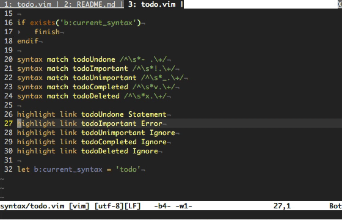

vim-tbuffer
===========

TBuffer provides a command to switch to a buffer in another tab.

## Demo

## License
Copyright © 2020 Teddy Wing. Licensed under the GNU GPLv3+ (see the included
COPYING file).
